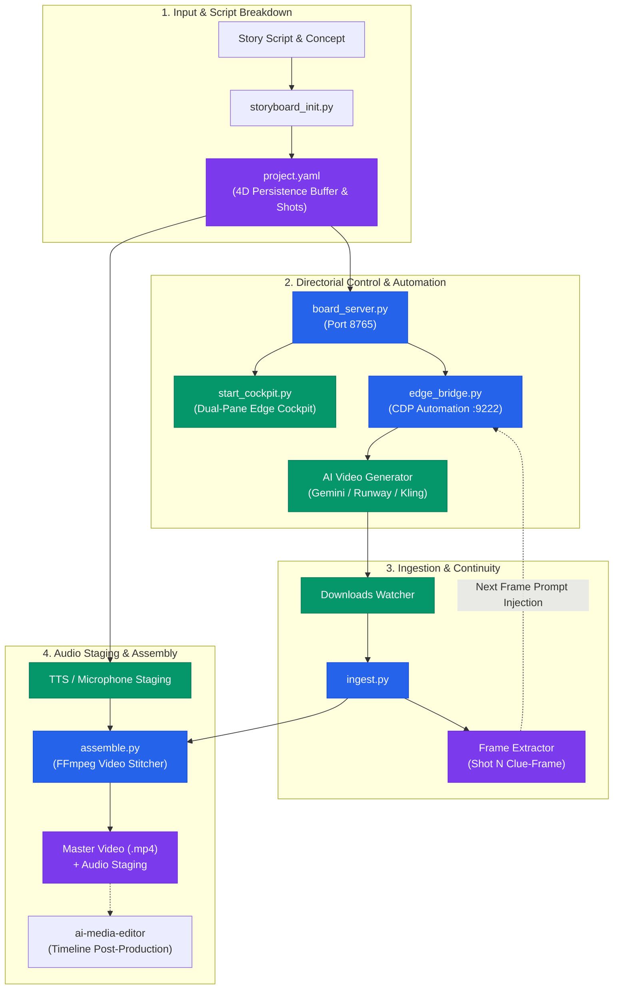
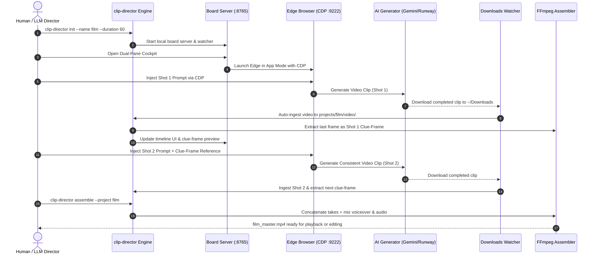

# clip-storyboard-director

<p align="center">
  <strong>Local-First AI Storyboard Director & Scene Continuity Orchestrator</strong><br>
  <em>Bridging AI video generators, browser automation (CDP), 4D persistence buffers, and multi-track audio assembly into a coherent directorial pipeline.</em>
</p>

<p align="center">
  <a href="README.md"><strong>English</strong></a> |
  <a href="README_de.md"><strong>Deutsch</strong></a>
</p>

<p align="center">
  <a href="https://github.com/ellmos-ai/clip-storyboard-director/actions/workflows/ci.yml"></a>
  <a href="https://img.shields.io/badge/pytest-passing-brightgreen"></a>
  <a href="https://img.shields.io/badge/python-3.10%20%7C%203.11%20%7C%203.12%20%7C%203.13-blue"></a>
  <a href="https://img.shields.io/badge/platform-Windows%20%7C%20Linux%20%7C%20macOS-lightgrey"></a>
  <a href="https://img.shields.io/badge/privacy-100%25%20Local--First%20%7C%20Zero--Egress-brightgreen"></a>
  <a href="https://img.shields.io/badge/security-RunAsInvoker%20%7C%20Localhost%20Isolated-blue"></a>
  <a href="https://img.shields.io/badge/security%20SLA-48h%20response%20%7C%205d%20triage-blue"></a>
  <a href="https://img.shields.io/badge/code%20style-ruff-000000.svg"></a>
  <a href="https://opensource.org/licenses/MIT"></a>
  <a href="https://github.com/ellmos-ai"></a>
  <a href="https://github.com/open-bricks"></a>
  <a href="https://github.com/ellmos-ai/clip-storyboard-director/releases"></a>
  <a href="llms.txt"></a>
  <a href="MARKETING-LOG.txt"></a>
</p>

---

### 🧭 Quick Navigation

- [1. Why This Exists](#why-this-exists)
- [2. Architecture & System Flow](#architecture--system-flow)
- [3. Director & Editor Duo](#director--editor-duo)
- [4. 4D Persistence & Bounded Continuity](#4d-persistence--bounded-continuity)
- [5. Clue-Frame Continuity Chain](#clue-frame-continuity-chain)
- [6. Dual-Pane Director Cockpit](#dual-pane-director-cockpit)
- [7. Multi-Track Audio Staging & Ducking](#multi-track-audio-staging--ducking)
- [8. Key Governance & Runtime Invariants](#key-governance--runtime-invariants)
- [9. End-to-End Media Production Lifecycle](#end-to-end-media-production-lifecycle)
- [10. Sibling Tools & Ecosystem Matrix](#sibling-tools--ecosystem-matrix)
- [11. Installation & CLI Usage](#installation--cli-usage)
- [12. Reference Production "Sternenseufzer"](#reference-production-sternenseufzer)
- [13. Security & Privacy](#security--privacy)
- [14. Development & Verification](#development--verification)

---

## Why This Exists

Generating individual AI video clips using models such as Veo, Kling, Sora, or Runway has become effortless. However, turning isolated clips into a **coherent narrative film** remains difficult. Creators face persistent challenges:

1. **Continuity Drift**: Characters alter clothing, facial features, or hairstyle from shot to shot.
2. **Context Amnesia**: Background environments and props disappear or morph between cuts.
3. **Manual Drag-and-Drop Fatigue**: Users constantly download clips from web browsers, rename them, extract final frames, and re-upload them as reference images.
4. **Dialogue & Audio Desynchronization**: Synthesized voices, background atmospheres, and music are often assembled as an afterthought without proper ducking or beat-matching.

`clip-storyboard-director` solves these problems through an automated, local-first directorial pipeline. It maintains a **4D persistence buffer** across all scenes, automatically extracts optical **clue-frames**, orchestrates web-based video generators via **Chrome DevTools Protocol (CDP)**, watches downloads, and assembles multi-track audio masters with zero cloud telemetry.

---

## Architecture & System Flow



---

## Director & Editor Duo

`clip-storyboard-director` is purposefully designed as the **Director** in a specialized two-agent media production model:

| Role | Tool | Focus & Responsibilities |
| :--- | :--- | :--- |
| **Director (Regisseur)** | `clip-storyboard-director` | **Pre-Production & Generation**: Script breakdown, shot timing, prompt engineering, 4D persistence buffer management, Edge CDP browser injection, clue-frame optical continuity, download auto-ingestion, and rough-cut master assembly. |
| **Cutter (Editor)** | `ai-media-editor` | **Post-Production**: Non-linear timeline editing, multi-track trim and split, color grading, fine transition curves, dynamic audio ducking, sub-frame cut synchronization, and final delivery rendering. |

> **Standalone Guarantee**: `clip-storyboard-director` operates 100% autonomously. It does not require `ai-media-editor` to generate, orchestrate, or assemble complete films. When `ai-media-editor` is available, seamless project handoff is supported via standard XML/EDL or project folder sharing.

---

## 4D Persistence & Bounded Continuity

In filmmaking, continuity spans 3 spatial dimensions plus time ($3D + T = 4D$). `clip-storyboard-director` enforces continuity constraints through its declarative `persistence_buffer` in `project.yaml`:

- **Characters**: Persistent identifiers, attire details, physical builds, hair color, and facial traits.
- **Locations**: Spatial layouts, architectural styles, lighting conditions, and camera perspectives.
- **Props & Objects**: Key items, materials, wear and tear, and persistent physical state across cuts.
- **Atmospheric Palette**: Color grading mood, weather conditions, time-of-day progression, and acoustic acoustics.

Every prompt generated by the director automatically inherits the active persistence parameters, preventing model hallucination and style drift.

---

## Clue-Frame Continuity Chain

The fundamental breakdown in multi-shot video generation occurs at the cut boundary. `clip-storyboard-director` introduces the **Clue-Frame Continuity Chain**:

1. **Deterministic Last-Frame Extraction**: Upon ingesting take $N$, `ingest.py` invokes `ffprobe` and `ffmpeg` to extract the exact final display frame ($T_{\text{end}}$).
2. **Optical Reference Anchoring**: The frame is stored under `projects/<name>/frames/shot<N>_lastframe.png`.
3. **Automated Prompt Chaining**: When shot $N+1$ is staged, the director injects shot $N$'s clue-frame as the initial image prompt into the generator tab via CDP or copies it directly to the desktop workspace.
4. **Seamless Motion Handoff**: The AI model uses the clue-frame as its visual starting point, ensuring zero visual pop, identical camera framing, and seamless physical motion across cuts.

---

## Dual-Pane Director Cockpit

The director features an integrated web-based timeline cockpit rendered via `start_cockpit.py` in Microsoft Edge App Mode (`--app=http://localhost:8765/cockpit.html`):

- **Left Pane (Storyboard Timeline)**: Complete scene cards with durations, active prompts, clue-frame previews, voiceover playback, and take selection controls.
- **Right Pane (Generation Studio)**: Embedded or parallel browser workspace connected via CDP for one-click prompt injection into Gemini, Kling, or Runway.
- **Real-Time Synchronized State**: Timeline modifications made in the browser cockpit instantly synchronize to `project.yaml` via local REST endpoints (`/api/projects/update_shot`).

---

## Multi-Track Audio Staging & Ducking

Narrative cinema requires layered soundscapes. `clip-storyboard-director` provisions a 3-tier audio architecture:

1. **Dialogue & Voiceover Track**: High-fidelity speech synthesis via local `edge-tts` or live microphone recordings captured directly from the cockpit UI.
2. **Ambient Atmosphere & Foley**: Environmental sounds staged per scene (e.g. observatory hum, night wind, footsteps).
3. **Musical Score**: Emotional soundtrack with automatic gain ducking during spoken dialogue passages via FFmpeg `sidechaincompress` and `amix` filters.

---

## Key Governance & Runtime Invariants

The following 10 invariants govern every execution of `clip-storyboard-director`:

| Guarantee | Invariant Code | Enforcement Mechanism | Verification Rule |
| :--- | :--- | :--- | :--- |
| **1. 100% Local-First Privacy** | `INV-LOCAL-01` | Zero telemetry, analytics, or external logging. | Source audit confirms zero remote data egress. |
| **2. Unprivileged Execution** | `INV-UNPRIV-02` | Standard user space (`RunAsInvoker`), no elevation. | `SECURITY.md` and runtime permissions verify non-root. |
| **3. Loopback IPC Isolation** | `INV-LOOPBACK-03` | Board server binds strictly to `127.0.0.1:8765`. | Port binding audit rejects `0.0.0.0` or external IPs. |
| **4. Subprocess Sandboxing** | `INV-SANDBOX-04` | Parameterized arrays for `ffmpeg` and `msedge`. | Zero `shell=True` invocations across all modules. |
| **5. 4D Persistence Continuity** | `INV-CONTINUITY-05` | Character/location buffer enforced in `project.yaml`. | Prompt compilation validates persistence inclusion. |
| **6. Clue-Frame Chaining** | `INV-CLUEFRAME-06` | Deterministic last-frame extraction per video take. | `ingest.py` verifies last frame creation on ingest. |
| **7. Standalone Decoupling** | `INV-STANDALONE-07` | Full operation without `ai-media-editor`. | `test_standalone_without_media_editor` passes. |
| **8. Multi-OS Parity** | `INV-MULTIOS-08` | `pathlib.Path` abstraction across Windows/Linux/macOS. | GitHub Actions CI matrix verifies multi-OS suite. |
| **9. Cloud-Sync Resilience** | `INV-SYNC-09` | Ignore patterns for locks (`LOCK.*`) and conflicts. | `.gitignore` contains conflict and mutex patterns. |
| **10. 48h Security SLA** | `INV-SLA-10` | 48h acknowledgment and 5-day triage commitment. | Documented in `SECURITY.md` and contract tests. |

---

## End-to-End Media Production Lifecycle



---

## Sibling Tools & Ecosystem Matrix

`clip-storyboard-director` is part of the **ellmos-ai** infrastructure and the broader **open-bricks** open-source software family:

| Repository | Domain & Focus | Relationship to Director |
| :--- | :--- | :--- |
| [ai-media-editor](https://github.com/ellmos-ai/ai-media-editor) | Post-Production & Timeline Editor | **Cutter Partner**: Receives assembled cuts for non-linear finishing. |
| [ellmos-voice-io](https://github.com/ellmos-ai/ellmos-voice-io) | Speech Synthesis & Audio I/O | Provides advanced voice models and multi-character audio staging. |
| [system-auditor](https://github.com/ellmos-ai/system-auditor) | Multi-Host Audit Engine | Validates code quality, lock governance, and metadata parity. |
| [system-explorer](https://github.com/ellmos-ai/system-explorer) | Local Environment Introspection | Inspects hardware encoders (NVENC/VAAPI) and local codecs. |
| [ellmos-controlcenter-mcp](https://github.com/ellmos-ai/ellmos-controlcenter-mcp) | Governance & Capability Control | Enforces agent permissions and tool routing. |
| [ellmos-delegation-authority](https://github.com/ellmos-ai/ellmos-delegation-authority) | Autonomous Task Delegation | Orchestrates autonomous multi-shot production runs. |
| [sqlite-transit-sync](https://github.com/ellmos-ai/sqlite-transit-sync) | Zero-Conflict Database Sync | Synchronizes storyboard state across distributed hosts. |
| [memoryhooker-provenance](https://github.com/ellmos-ai/memoryhooker-provenance) | Context Hooking & Memory | Preserves narrative decisions across long-form video projects. |
| [workflowhooker-provenance](https://github.com/ellmos-ai/workflowhooker-provenance) | Workflow Tracking & Audit Trails | Captures prompt lineage, take variations, and model versions. |
| [automation-master](https://github.com/ellmos-ai/automation-master) | Enterprise Workflow Automation | Schedules background rendering and automated asset ingestion. |
| [automizer-for-claude-desktop](https://github.com/ellmos-ai/automizer-for-claude-desktop) | Claude Desktop Integration | Connects LLM directors directly to the timeline cockpit. |
| [WikiStub-Seed](https://github.com/ellmos-ai/WikiStub-Seed) | World-Building Knowledge Graphs | Generates detailed lore and character profiles for 4D buffers. |
| [ProSync](https://github.com/file-bricks/prosync) | Resilient File Mirroring | Mirrors video assets across editing workstations. |
| [CleanMarkdown](https://github.com/doc-bricks/cleanmarkdown) | Documentation Sanitizer | Normalizes scripts, screenplays, and directorial notes. |
| [PrivacyMailDesk](https://github.com/dev-bricks/privacymaildesk) | Local Mail Processing | Notifies producers upon render completions without cloud telemetry. |
| [prompt-archaeology-casestudy2](https://github.com/research-line/prompt-archaeology-casestudy2) | Prompt Engineering Research | Provides proven continuity prompts for video generation models. |
| [open-bricks](https://github.com/open-bricks/open-bricks) | Umbrella Open-Source Ecosystem | Architectural governance, security SLAs, and release standards. |

---

## Installation & CLI Usage

### Requirements

- **Python**: 3.10, 3.11, 3.12, or 3.13
- **FFmpeg & FFprobe**: Required in system `PATH` for frame extraction and video assembly
- **Microsoft Edge** (or Chrome): For optional CDP browser automation
- **Optional Python Packages**: `edge-tts` (speech synthesis), `websocket-client` (CDP bridge)

### Installation

```bash
# Clone the repository
git clone https://github.com/ellmos-ai/clip-storyboard-director.git
cd clip-storyboard-director

# Install package in editable mode with development dependencies
pip install -e ".[dev]"
```

### System Health Check (`doctor`)

Verify all binaries, Python dependencies, and browser connections:

```bash
clip-director doctor
```

### CLI Command Reference

```bash
# 1. Initialize a new storyboard project (60s total, 10s per shot)
clip-director init --name my_film --title "My Narrative Film" --duration 60 --step 10

# 2. Render the interactive HTML timeline dashboard
clip-director render --project projects/my_film

# 3. Start the local board server (default port 8765)
clip-director serve --project projects/my_film --port 8765

# 4. Launch the dual-pane director cockpit in Microsoft Edge
clip-director cockpit --project my_film

# 5. Check Edge CDP connection status
clip-director cdp-status --port 9222

# 6. Watch downloads folder and automatically ingest new clips
clip-director ingest --project projects/my_film --watch

# 7. Synthesize dialogue voiceover for a specific shot
clip-director voice --project projects/my_film --step 1

# 8. Assemble final master video with mixed audio
clip-director assemble --project projects/my_film

# 9. Autonomous end-to-end production run
clip-director auto --project projects/my_film
```

---

## Reference Production "Sternenseufzer"

The repository includes a complete reference production under `projects/sternenseufzer/` demonstrating the entire workflow:

- **Genre**: Sci-Fi Drama / Narrative Short
- **Plot**: An astronomer in a high-altitude observatory detects an anomalous acoustic resonance in starlight data.
- **Continuity Matrix**: Pre-configured 4D persistence buffer tracking Dr. Alistair Vance, the observatory dome, and the quantum spectrum analyzer.
- **Voiceover**: Bilingual directives (German source, English translation) and silent directives pre-generated.

Explore the reference project directly:
```bash
clip-director render --project projects/sternenseufzer
clip-director assemble --project projects/sternenseufzer
```

---

## Security & Privacy

- **Zero-Egress Guarantee**: `clip-storyboard-director` contains zero network telemetry, tracking pixels, or remote error reporting.
- **RunAsInvoker**: Operates strictly within standard unprivileged user permissions.
- **Localhost Isolation**: Web services bind strictly to `127.0.0.1`.
- **Security SLA**: We acknowledge vulnerability reports within 48 hours and provide initial triage within 5 business days. See [SECURITY.md](SECURITY.md) for reporting channels.

---

## Development & Verification

### Running Linting & Type Checks

```bash
ruff check src tests
python -m compileall -q src tests
```

### Running Test Suite

```bash
pytest -v
```

---

<p align="center">
  Part of the <strong><a href="https://github.com/ellmos-ai">ellmos-ai</a></strong> suite under the <strong><a href="https://github.com/open-bricks">open-bricks</a></strong> umbrella.
</p>
