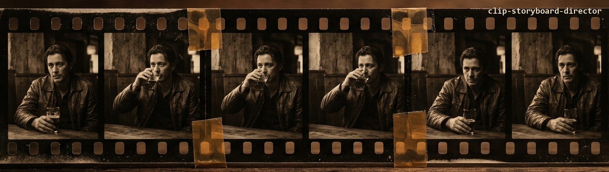
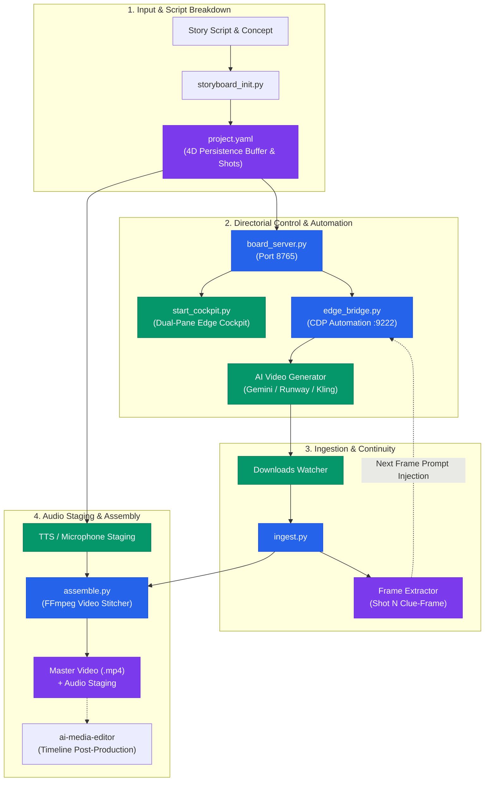
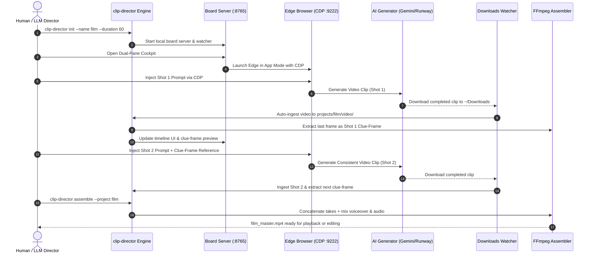

<p align="center">
  
</p>
<!-- alternate banner: assets/banner.svg (swap on occasion) -->

# clip-storyboard-director

<p align="center">
  <strong>Local-First AI Storyboard Director & Scene Continuity Orchestrator</strong><br>
  <em>Bridging AI video generators, browser automation (CDP), 4D persistence buffers, and multi-track audio assembly into a coherent directorial pipeline.</em>
</p>

<p align="center">
  <a href="README.md"><strong>English</strong></a> |
  <a href="README_de.md"><strong>Deutsch</strong></a>
</p>

<p align="center">
  <a href="https://github.com/ellmos-ai/clip-storyboard-director/actions/workflows/ci.yml"></a>
  <a href="#17-development-verification--quality-gates"></a>
  <a href="https://img.shields.io/badge/python-3.10%20%7C%203.11%20%7C%203.12%20%7C%203.13-blue"></a>
  <a href="https://img.shields.io/badge/platform-Windows%20%7C%20Linux%20%7C%20macOS-lightgrey"></a>
  <a href="SECURITY.md"></a>
  <a href="THIRD_PARTY_LICENSES.md"></a>
  <a href="SECURITY.md"></a>
  <a href="THIRD_PARTY_LICENSES.md"></a>
  <a href="THIRD_PARTY_LICENSES.md"></a>
  <a href="NOTICE"></a>
  <a href="THIRD_PARTY_LICENSES.md"></a>
  <a href="MARKETING-LOG.txt"></a>
  <a href="https://github.com/astral-sh/ruff"></a>
  <a href="LICENSE"></a>
  <a href="https://github.com/ellmos-ai"></a>
  <a href="https://github.com/open-bricks"></a>
  <a href="https://github.com/ellmos-ai/clip-storyboard-director/releases"></a>
  <a href="llms.txt"></a>
  <a href="MARKETING-LOG.txt"></a>
</p>

---

### 🧭 Quick Navigation

- [1. Executive Summary & Why This Exists](#1-executive-summary--why-this-exists)
- [2. Architecture & System Flow](#2-architecture--system-flow)
- [3. Director & Editor Duo](#3-director--editor-duo)
- [4. 4D Persistence & Bounded Continuity](#4-4d-persistence--bounded-continuity)
- [5. Clue-Frame Continuity Chain](#5-clue-frame-continuity-chain)
- [6. Dual-Pane Director Cockpit](#6-dual-pane-director-cockpit)
- [7. Multi-Track Audio Staging & Ducking](#7-multi-track-audio-staging--ducking)
- [8. Key Governance & Runtime Invariants](#8-key-governance--runtime-invariants)
- [9. End-to-End Media Production Lifecycle](#9-end-to-end-media-production-lifecycle)
- [10. Target Personas & Discoverability](#10-target-personas--discoverability)
- [11. Comparative Matrix vs. Alternatives](#11-comparative-matrix-vs-alternatives)
- [12. Third-Party Licenses, Level 1 SBOM & RunAsInvoker](#12-third-party-licenses-level-1-sbom--runasinvoker)
- [13. Sibling Tools & Ecosystem Matrix](#13-sibling-tools--ecosystem-matrix)
- [14. Installation & CLI Usage](#14-installation--cli-usage)
- [15. Reference Production "Sternenseufzer"](#15-reference-production-sternenseufzer)
- [16. Security Policy & Privacy](#16-security-policy--privacy)
- [17. Development, Verification & Quality Gates](#17-development-verification--quality-gates)
- [18. Statutory Notice, Liability Limitation & License (§ 521 BGB)](#18-statutory-notice-liability-limitation--license--521-bgb)

---

<a id="1-executive-summary--why-this-exists"></a><a id="1-executive-summary--warum-dieses-projekt-existiert"></a><a id="why-this-exists"></a><a id="warum-dieses-projekt-existiert"></a>
## 1. Executive Summary & Why This Exists

Generating individual AI video clips using models such as Veo, Kling, Sora, or Runway has become effortless. However, turning isolated clips into a **coherent narrative film** remains difficult. Creators face persistent challenges:

1. **Continuity Drift**: Characters alter clothing, facial features, or hairstyle from shot to shot.
2. **Context Amnesia**: Background environments and props disappear or morph between cuts.
3. **Manual Drag-and-Drop Fatigue**: Users constantly download clips from web browsers, rename them, extract final frames, and re-upload them as reference images.
4. **Dialogue & Audio Desynchronization**: Synthesized voices, background atmospheres, and music are often assembled as an afterthought without proper ducking or beat-matching.

`clip-storyboard-director` solves these problems through an automated, local-first directorial pipeline. It maintains a **4D persistence buffer** across all scenes, automatically extracts optical **clue-frames**, orchestrates web-based video generators via **Chrome DevTools Protocol (CDP)**, watches downloads, and assembles multi-track audio masters with zero cloud telemetry.

---

<a id="2-architecture--system-flow"></a><a id="2-systemarchitektur--workflow"></a><a id="architecture--system-flow"></a><a id="systemarchitektur--workflow"></a>
## 2. Architecture & System Flow



---

<a id="3-director--editor-duo"></a><a id="3-das-regie---cutter-duo"></a><a id="director--editor-duo"></a><a id="das-regie---cutter-duo"></a>
## 3. Director & Editor Duo

`clip-storyboard-director` is purposefully designed as the **Director** in a specialized two-agent media production model:

| Role | Tool | Focus & Responsibilities |
| :--- | :--- | :--- |
| **Director (Regisseur)** | `clip-storyboard-director` | **Pre-Production & Generation**: Script breakdown, shot timing, prompt engineering, 4D persistence buffer management, Edge CDP browser injection, clue-frame optical continuity, download auto-ingestion, and rough-cut master assembly. |
| **Cutter (Editor)** | `ai-media-editor` | **Post-Production**: Non-linear timeline editing, multi-track trim and split, color grading, fine transition curves, dynamic audio ducking, sub-frame cut synchronization, and final delivery rendering. |

> **Standalone Guarantee**: `clip-storyboard-director` operates 100% autonomously. It does not require `ai-media-editor` to generate, orchestrate, or assemble complete films. When `ai-media-editor` is available, seamless project handoff is supported via standard XML/EDL or project folder sharing.

---

<a id="4-4d-persistence--bounded-continuity"></a><a id="4-4d-persistenz--buendige-kontinuitaet"></a><a id="4d-persistence--bounded-continuity"></a><a id="4d-persistenz--bündige-kontinuität"></a>
## 4. 4D Persistence & Bounded Continuity

In filmmaking, continuity spans 3 spatial dimensions plus time ($3D + T = 4D$). `clip-storyboard-director` enforces continuity constraints through its declarative `persistence_buffer` in `project.yaml`:

- **Characters**: Persistent identifiers, attire details, physical builds, hair color, and facial traits.
- **Locations**: Spatial layouts, architectural styles, lighting conditions, and camera perspectives.
- **Props & Objects**: Key items, materials, wear and tear, and persistent physical state across cuts.
- **Atmospheric Palette**: Color grading mood, weather conditions, time-of-day progression, and acoustic acoustics.

Every prompt generated by the director automatically inherits the active persistence parameters, preventing model hallucination and style drift.

---

<a id="5-clue-frame-continuity-chain"></a><a id="5-clue-frame-kontinuitaetskette"></a><a id="clue-frame-continuity-chain"></a><a id="clue-frame-kontinuitätskette"></a>
## 5. Clue-Frame Continuity Chain

The fundamental breakdown in multi-shot video generation occurs at the cut boundary. `clip-storyboard-director` introduces the **Clue-Frame Continuity Chain**:

1. **Deterministic Last-Frame Extraction**: Upon ingesting take $N$, `ingest.py` invokes `ffprobe` and `ffmpeg` to extract the exact final display frame ($T_{\text{end}}$).
2. **Optical Reference Anchoring**: The frame is stored under `projects/<name>/frames/shot<N>_lastframe.png`.
3. **Automated Prompt Chaining**: When shot $N+1$ is staged, the director injects shot $N$'s clue-frame as the initial image prompt into the generator tab via CDP or copies it directly to the desktop workspace.
4. **Seamless Motion Handoff**: The AI model uses the clue-frame as its visual starting point, ensuring zero visual pop, identical camera framing, and seamless physical motion across cuts.

---

<a id="6-dual-pane-director-cockpit"></a><a id="6-dual-pane-regie-cockpit"></a><a id="dual-pane-director-cockpit"></a><a id="dual-pane-regie-cockpit"></a>
## 6. Dual-Pane Director Cockpit

The director features an integrated web-based timeline cockpit rendered via `start_cockpit.py` in Microsoft Edge App Mode (`--app=http://localhost:8765/cockpit.html`):

- **Left Pane (Storyboard Timeline)**: Complete scene cards with durations, active prompts, clue-frame previews, voiceover playback, and take selection controls.
- **Right Pane (Generation Studio)**: Embedded or parallel browser workspace connected via CDP for one-click prompt injection into Gemini, Kling, or Runway.
- **Real-Time Synchronized State**: Timeline modifications made in the browser cockpit instantly synchronize to `project.yaml` via local REST endpoints (`/api/projects/update_shot`).

---

<a id="7-multi-track-audio-staging--ducking"></a><a id="7-mehrspur-audio-staging--dynamisches-ducking"></a><a id="multi-track-audio-staging--ducking"></a><a id="mehrspur-audio-staging--dynamisches-ducking"></a>
## 7. Multi-Track Audio Staging & Ducking

Narrative cinema requires layered soundscapes. `clip-storyboard-director` provisions a 3-tier audio architecture:

1. **Dialogue & Voiceover Track**: High-fidelity speech synthesis via local `edge-tts` or live microphone recordings captured directly from the cockpit UI.
2. **Ambient Atmosphere & Foley**: Environmental sounds staged per scene (e.g. observatory hum, night wind, footsteps).
3. **Musical Score**: Emotional soundtrack with automatic gain ducking during spoken dialogue passages via FFmpeg `sidechaincompress` and `amix` filters.

---

<a id="8-key-governance--runtime-invariants"></a><a id="8-governance---laufzeit-invarianten"></a><a id="key-governance--runtime-invariants"></a><a id="governance---laufzeit-invarianten"></a>
## 8. Key Governance & Runtime Invariants

The following 10 invariants govern every execution of `clip-storyboard-director`:

| Guarantee | Invariant Code | Enforcement Mechanism | Verification Rule |
| :--- | :--- | :--- | :--- |
| **1. 100% Local-First Privacy** | `INV-LOCAL-01` | Zero telemetry, analytics, or external logging. | Source audit confirms zero remote data egress. |
| **2. Unprivileged Execution** | `INV-UNPRIV-02` | Standard user space (`RunAsInvoker`), no elevation. | `SECURITY.md` and runtime permissions verify non-root. |
| **3. Loopback IPC Isolation** | `INV-LOOPBACK-03` | Board server binds strictly to `127.0.0.1:8765`. | Port binding audit rejects `0.0.0.0` or external IPs. |
| **4. Subprocess Sandboxing** | `INV-SANDBOX-04` | Parameterized arrays for `ffmpeg` and `msedge`. | Zero `shell=True` invocations across all modules. |
| **5. 4D Persistence Continuity** | `INV-CONTINUITY-05` | Character/location buffer enforced in `project.yaml`. | Prompt compilation validates persistence inclusion. |
| **6. Clue-Frame Chaining** | `INV-CLUEFRAME-06` | Deterministic last-frame extraction per video take. | `ingest.py` verifies last frame creation on ingest. |
| **7. Standalone Decoupling** | `INV-STANDALONE-07` | Full operation without `ai-media-editor`. | `test_standalone_without_media_editor` passes. |
| **8. Multi-OS Parity** | `INV-MULTIOS-08` | `pathlib.Path` abstraction across Windows/Linux/macOS. | GitHub Actions CI matrix verifies multi-OS suite. |
| **9. Cloud-Sync Resilience** | `INV-SYNC-09` | Ignore patterns for locks (`LOCK.*`) and conflicts. | `.gitignore` contains conflict and mutex patterns. |
| **10. 48h Security SLA** | `INV-SLA-10` | 48h acknowledgment and 5-day triage commitment. | Documented in `SECURITY.md` and contract tests. |

---

<a id="9-end-to-end-media-production-lifecycle"></a><a id="9-end-to-end-medien---produktions-lebenszyklus"></a><a id="end-to-end-media-production-lifecycle"></a><a id="end-to-end-medien---produktions-lebenszyklus"></a>
## 9. End-to-End Media Production Lifecycle



---

<a id="10-target-personas--discoverability"></a><a id="10-zielgruppen--auffindbarkeit"></a><a id="target-personas--discoverability"></a><a id="zielgruppen--auffindbarkeit"></a>
## 10. Target Personas & Discoverability

`clip-storyboard-director` is engineered to empower four primary user profiles across the generative media ecosystem:

| Target Persona | Key Pain Points | Core Solution & Value Proposition | Typical Workflow |
| :--- | :--- | :--- | :--- |
| **AI Filmmakers & Narrative Directors** | Face and wardrobe drift across shots, disjointed scene cuts, manual prompt juggling. | Declarative 4D Persistence Buffer (`project.yaml`) and automated optical clue-frame chaining between shot ends and starts. | `clip-director init` -> define 4D buffer -> review clue-frames -> assemble cut. |
| **Generative Media Engineers** | Web-based generator portals lack scriptable automation and structured asset ingestion. | Chrome DevTools Protocol (CDP) bridge on port 9222 and real-time downloads watcher with automatic asset sorting. | Launch Edge CDP bridge -> execute scripted take loop -> auto-ingest clips. |
| **Content Creators & YouTubers** | Manual speech synthesis, timing, and mixing with music beds in heavy editing suites is slow. | Integrated speech synthesis via `edge-tts` and automated side-chain audio ducking across four dedicated audio tracks. | Script scene dialogue -> `clip-director voice` -> `clip-director assemble`. |
| **Autonomous Coding Agents** | Cloud-dependent tools require OAuth/API tokens, elevate permissions, or fail without GUI. | 100% Local-first zero-egress architecture (`INV-LOCAL-01`), unprivileged `RunAsInvoker` CLI, and machine-readable `llms.txt`. | Headless execution via `clip-director auto` -> system check via `clip-director doctor`. |

### High-Intent Search Queries

- **English**: `ai storyboard director`, `scene continuity python`, `clue-frame video generator`, `local-first ai video orchestrator`, `veo kling runway automation`, `edge cdp video workflow`, `4d persistence buffer`, `automated audio staging and ducking python`.
- **German**: `clip-storyboard-director lokale KI-Regie`, `KI Storyboard Regisseur Python`, `Szenen-Kontinuität generative Videomodelle`, `Clue-Frame optische Bildverkettung`, `Lokale Video-Orchestrierung ohne Cloud-Zwang`, `Edge CDP Browser-Automatisierung KI Video`, `4D-Persistenzpuffer Charakter-Kontinuität`, `Mehrspur-Audio-Staging und Ducking FFmpeg`.

---

<a id="11-comparative-matrix-vs-alternatives"></a><a id="11-vergleichsmatrix-vs-alternativen"></a><a id="comparative-matrix-vs-alternatives"></a><a id="vergleichsmatrix-vs-alternativen"></a>
## 11. Comparative Matrix vs. Alternatives

The table below benchmarks `clip-storyboard-director` across 10 architectural and governance dimensions against 4 standard industry alternatives:

| Dimension / Capability | `clip-storyboard-director` | Commercial Video SaaS (Runway / Pika / Kling) | Manual Web Browser Workflow | Heavy Desktop NLEs (Premiere / DaVinci) | Ad-Hoc Python Scripts & Shell Glue |
| :--- | :--- | :--- | :--- | :--- | :--- |
| **1. Local-First & Zero-Egress** | **100% Local-First (`INV-LOCAL-01`)**; zero cloud telemetry or media leaks. | ❌ Mandatory cloud SaaS; user media stored on remote servers. | ❌ Web-bound manual uploads; prone to cloud data leakage. | Local desktop app; heavy background telemetry services. | Varies; typically relies on unpinned cloud APIs. |
| **2. Scene Continuity & 4D Buffer** | **Built-in 4D persistence buffer (`INV-CONTINUITY-05`)** for characters, locations, objects. | ⚠️ Ephemeral prompt history; frequent character & wardrobe drift. | ❌ Manual prompt copy-pasting; severe context loss between shots. | ❌ No native generative continuity engine. | ❌ Fragile custom scripts; lack bounded 4D context models. |
| **3. Clue-Frame Optical Chaining** | **Automated tail-frame extraction (`INV-CLUEFRAME-06`)** seeding next shot prompts. | ❌ Manual end-frame extraction and re-upload per shot. | ❌ Tedious manual download, frame grab, and upload loop. | ❌ None built-in for AI generator prompts. | ⚠️ Ad-hoc FFmpeg scripts; lack automated seed validation. |
| **4. Browser Generator Automation** | **Direct Chrome DevTools Protocol (CDP)** bridge on port `9222`. | ❌ Proprietary closed web UIs without scriptable hooks. | ❌ 100% manual clicking, dragging, and parameter re-entry. | ❌ No direct browser-to-generator automation bridge. | ⚠️ Fragile Selenium or Playwright browser scrapers. |
| **5. Audio Staging & Multi-Track Ducking** | **Integrated 4-track mix + automated speech ducking** (`assemble.py`). | ❌ Minimal or single-track audio; no side-chain ducking. | ❌ No audio staging; requires external post-processing tools. | Full manual multi-track mixing; high manual time overhead. | ❌ Complex filtergraphs prone to audio desynchronization. |
| **6. Dual-Pane Visual Cockpit** | **Integrated split-screen dashboard** (Timeline & Generator Bridge). | ❌ Single tab view; disjointed asset previews. | ❌ Cluttered multi-window desktop and browser tabs. | Complex multi-panel editing interfaces requiring deep training. | ❌ Headless only; zero visual interactive timeline controls. |
| **7. Runtime Footprint & Level 1 SBOM** | **Lightweight Python stdlib + PyYAML / edge-tts**; Level 1 SBOM audited. | Heavy web frontend requiring continuous internet bandwidth. | N/A (human effort and browser memory consumption). | 5 GB+ proprietary desktop installers with heavy GPU footprint. | Unpinned virtualenvs; unpredictable dependencies. |
| **8. Agentic Discoverability (LLM-Ready)** | **Native `llms.txt` + `ellmos-module.v2.json`**; deterministic CLI interfaces. | ❌ Anti-bot scraping protections and cloud CAPTCHAs. | ❌ Incompatible with autonomous agentic execution. | ❌ Proprietary closed scripting APIs (Lua/ExtendScript). | ⚠️ Ad-hoc CLI flags without structured machine metadata. |
| **9. Privilege Model & User Safety** | **Unprivileged `RunAsInvoker` (`INV-UNPRIV-02`)**; loopback isolation (`127.0.0.1`). | Cloud SaaS account requiring billing and subscription tokens. | User browser session subject to session hijack risks. | Often requires administrative elevation during installation. | Varies; occasionally run as root or elevated shell. |
| **10. Security SLA & Governance** | **Formal 48h response & 5-day triage SLA (`INV-SLA-10`)**; § 521 BGB disclaimer. | Standard commercial SaaS Terms of Service. | N/A; individual browser user responsibility. | Vendor enterprise patch cycles; slow turnaround times. | ❌ Zero vulnerability response commitments or triage SLAs. |

---

<a id="12-third-party-licenses-level-1-sbom--runasinvoker"></a><a id="12-drittanbieter-lizenzen-level-1-sbom--runasinvoker"></a><a id="third-party-licenses--transparency"></a><a id="drittanbieter-lizenzen--transparenz"></a>
## 12. Third-Party Licenses, Level 1 SBOM & RunAsInvoker

`clip-storyboard-director` adheres to strict open-source governance, permissive licensing, and zero-egress runtime invariants:

- **Core Module**: Licensed under the permissive [MIT License](LICENSE) with attribution declared in [NOTICE](NOTICE).
- **Runtime Dependencies**:
  - `PyYAML` (MIT License): Declarative project configuration and persistence buffer parsing.
  - `edge-tts` (GNU GPL-3.0): Standalone local speech synthesis subprocess.
  - `websocket-client` (Apache-2.0): Loopback Chrome DevTools Protocol socket communication.
  - `requests` (Apache-2.0): Loopback HTTP target discovery on `127.0.0.1:9222`.
- **External Binaries**:
  - `FFmpeg / FFprobe` (LGPL-2.1+ / GPL-2.0+): System PATH media probing, clue-frame extraction, and audio-video stitching.
  - `Microsoft Edge`: Optional host browser for dual-pane cockpit and CDP automation.
- **Compliance & Level 1 SBOM**:
  - `INV-LOCAL-01`: 100% offline, zero cloud tracking, zero external telemetry.
  - `INV-UNPRIV-02`: Operates strictly within unprivileged user mode (`RunAsInvoker`).
  - Full Level 1 SBOM and Invariant Cross-Reference Matrix are cataloged in [THIRD_PARTY_LICENSES.md](THIRD_PARTY_LICENSES.md).

---

<a id="13-sibling-tools--ecosystem-matrix"></a><a id="13-geschwisterwerkzeuge--partner-matrix"></a><a id="sibling-tools--ecosystem-matrix"></a><a id="geschwisterwerkzeuge--partner-matrix"></a>
## 13. Sibling Tools & Ecosystem Matrix

`clip-storyboard-director` is part of the **ellmos-ai** infrastructure and the broader **open-bricks** open-source software family:

| Repository | Domain & Focus | Relationship to Director |
| :--- | :--- | :--- |
| [ai-media-editor](https://github.com/ellmos-ai/ai-media-editor) | Post-Production & Timeline Editor | **Cutter Partner**: Receives assembled cuts for non-linear finishing. |
| [ellmos-voice-io](https://github.com/ellmos-ai/ellmos-voice-io) | Speech Synthesis & Audio I/O | Provides advanced voice models and multi-character audio staging. |
| [system-auditor](https://github.com/ellmos-ai/system-auditor) | Multi-Host Audit Engine | Validates code quality, lock governance, and metadata parity. |
| [system-explorer](https://github.com/ellmos-ai/system-explorer) | Local Environment Introspection | Inspects hardware encoders (NVENC/VAAPI) and local codecs. |
| [ellmos-controlcenter-mcp](https://github.com/ellmos-ai/ellmos-controlcenter-mcp) | Governance & Capability Control | Enforces agent permissions and tool routing. |
| [ellmos-delegation-authority](https://github.com/ellmos-ai/ellmos-delegation-authority) | Autonomous Task Delegation | Orchestrates autonomous multi-shot production runs. |
| [sqlite-transit-sync](https://github.com/ellmos-ai/sqlite-transit-sync) | Zero-Conflict Database Sync | Synchronizes storyboard state across distributed hosts. |
| [memoryhooker-provenance](https://github.com/ellmos-ai/memoryhooker-provenance) | Context Hooking & Memory | Preserves narrative decisions across long-form video projects. |
| [workflowhooker-provenance](https://github.com/ellmos-ai/workflowhooker-provenance) | Workflow Tracking & Audit Trails | Captures prompt lineage, take variations, and model versions. |
| [automation-master](https://github.com/ellmos-ai/automation-master) | Enterprise Workflow Automation | Schedules background rendering and automated asset ingestion. |
| [automizer-for-claude-desktop](https://github.com/ellmos-ai/automizer-for-claude-desktop) | Claude Desktop Integration | Connects LLM directors directly to the timeline cockpit. |
| [WikiStub-Seed](https://github.com/ellmos-ai/WikiStub-Seed) | World-Building Knowledge Graphs | Generates detailed lore and character profiles for 4D buffers. |
| [ProSync](https://github.com/file-bricks/prosync) | Resilient File Mirroring | Mirrors video assets across editing workstations. |
| [CleanMarkdown](https://github.com/doc-bricks/cleanmarkdown) | Documentation Sanitizer | Normalizes scripts, screenplays, and directorial notes. |
| [PrivacyMailDesk](https://github.com/dev-bricks/privacymaildesk) | Local Mail Processing | Notifies producers upon render completions without cloud telemetry. |
| [prompt-archaeology-casestudy2](https://github.com/research-line/prompt-archaeology-casestudy2) | Prompt Engineering Research | Provides proven continuity prompts for video generation models. |
| [open-bricks](https://github.com/open-bricks/open-bricks) | Umbrella Open-Source Ecosystem | Architectural governance, security SLAs, and release standards. |

---

<a id="14-installation--cli-usage"></a><a id="14-installation--cli-befehlsreferenz"></a><a id="installation--cli-usage"></a><a id="installation--cli-befehlsreferenz"></a>
## 14. Installation & CLI Usage

### Requirements

- **Python**: 3.10, 3.11, 3.12, or 3.13
- **FFmpeg & FFprobe**: Required in system `PATH` for frame extraction and video assembly
- **Microsoft Edge** (or Chrome): For optional CDP browser automation
- **Optional Python Packages**: `edge-tts` (speech synthesis), `websocket-client` (CDP bridge)

### Installation

```bash
# Clone the repository
git clone https://github.com/ellmos-ai/clip-storyboard-director.git
cd clip-storyboard-director

# Install package in editable mode with development dependencies
pip install -e ".[dev]"
```

### System Health Check (`doctor`)

Verify all binaries, Python dependencies, and browser connections:

```bash
clip-director doctor
```

### CLI Command Reference

```bash
# 1. Initialize a new storyboard project (60s total, 10s per shot)
clip-director init --name my_film --title "My Narrative Film" --duration 60 --step 10

# 2. Render the interactive HTML timeline dashboard
clip-director render --project projects/my_film

# 3. Start the local board server (default port 8765)
clip-director serve --project projects/my_film --port 8765

# 4. Launch the dual-pane director cockpit in Microsoft Edge
clip-director cockpit --project my_film

# 5. Check Edge CDP connection status
clip-director cdp-status --port 9222

# 6. Watch downloads folder and automatically ingest new clips
clip-director ingest --project projects/my_film --watch

# 7. Synthesize dialogue voiceover for a specific shot
clip-director voice --project projects/my_film --step 1

# 8. Assemble final master video with mixed audio
clip-director assemble --project projects/my_film

# 9. Autonomous end-to-end production run
clip-director auto --project projects/my_film
```

---

<a id="15-reference-production-sternenseufzer"></a><a id="15-referenzproduktion-sternenseufzer"></a><a id="reference-production-sternenseufzer"></a><a id="referenzproduktion-sternenseufzer"></a>
## 15. Reference Production "Sternenseufzer"

The repository includes a complete reference production under `projects/sternenseufzer/` demonstrating the entire workflow:

- **Genre**: Sci-Fi Drama / Narrative Short
- **Plot**: An astronomer in a high-altitude observatory detects an anomalous acoustic resonance in starlight data.
- **Continuity Matrix**: Pre-configured 4D persistence buffer tracking Dr. Alistair Vance, the observatory dome, and the quantum spectrum analyzer.
- **Voiceover**: Bilingual directives (German source, English translation) and silent directives pre-generated.

Explore the reference project directly:
```bash
clip-director render --project projects/sternenseufzer
clip-director assemble --project projects/sternenseufzer
```

---

<a id="16-security-policy--privacy"></a><a id="16-sicherheit--datenschutz"></a><a id="security--privacy"></a><a id="sicherheit--datenschutz"></a>
## 16. Security Policy & Privacy

- **Zero-Egress Guarantee**: `clip-storyboard-director` contains zero network telemetry, tracking pixels, or remote error reporting (`INV-LOCAL-01`).
- **RunAsInvoker**: Operates strictly within standard unprivileged user permissions (`INV-UNPRIV-02`).
- **Localhost Isolation**: Web services bind strictly to `127.0.0.1` (`INV-LOOPBACK-03`).
- **Security SLA**: We acknowledge vulnerability reports within 48 hours and provide initial triage within 5 business days (`INV-SLA-10`). See [SECURITY.md](SECURITY.md) for reporting channels.

---

<a id="17-development-verification--quality-gates"></a><a id="17-entwicklung-verifikation--qualitaets-gates"></a><a id="development--verification"></a><a id="entwicklung--verifikation"></a>
## 17. Development, Verification & Quality Gates

### Running Linting & Type Checks

```bash
ruff check src tests
python -m compileall -q src tests
```

### Running Test Suite

```bash
pytest -v
```

---

<a id="18-statutory-notice-liability-limitation--license--521-bgb"></a><a id="18-gesetzlicher-hinweis-haftungsbeschraenkung--lizenz--521-bgb"></a><a id="license--statutory-liability-limitation"></a><a id="lizenz--gesetzliche-haftungsbeschraenkung"></a><a id="license"></a>
## 18. Statutory Notice, Liability Limitation & License (§ 521 BGB)

### Statutory Notice & Limitation of Liability (§ 521 BGB)
The provision of this software is made free of charge as a statutory courtesy (*Gefälligkeit* / *unentgeltliche Schenkung* pursuant to **§ 521 BGB** of the German Civil Code). Under German statutory law, liability of the author and contributors is strictly limited to intent and gross negligence (*Vorsatz und grobe Fahrlässigkeit*).

### License
This project is licensed under the terms of the **MIT License**. See [LICENSE](LICENSE) and [NOTICE](NOTICE) for complete copyright and attribution details.

---

<p align="center">
  Part of the <strong><a href="https://github.com/ellmos-ai">ellmos-ai</a></strong> suite under the <strong><a href="https://github.com/open-bricks">open-bricks</a></strong> umbrella.
</p>
