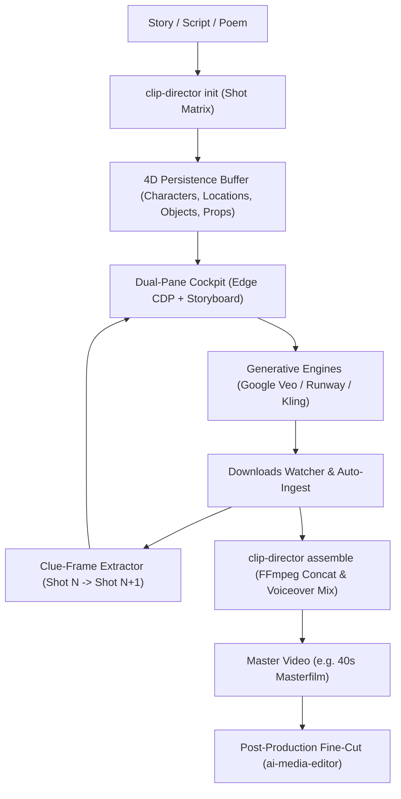

# clip-storyboard-director 🎬

<p align="center">
  <strong>Local-First AI Storyboard Director & Video Pipeline Controller</strong><br>
  <em>Turn scripts and poems into coherent multi-shot AI films with visual continuity, browser CDP automation, and interactive timeline cockpit.</em>
</p>

<p align="center">
  
  
  
  
  
</p>

---

## 🌟 Overview

Generative AI video models (Google Veo, Runway Gen-3, Kling AI, Luma Dream Machine) excel at creating stunning short takes (5s–10s), but lack temporal coherence and context across an entire movie.

**`clip-storyboard-director`** solves this by acting as the **digital film director**:
1. **Discrete Shot Scheduling:** Breaks your script, poem, or commercial into frame-accurate temporal steps (e.g. 4 × 10s = 40s master clip).
2. **4D Persistence Buffer:** Enforces consistency across **Characters**, **Locations**, **Objects**, and **Props** via image references and visual prompt diffs.
3. **Clue-Frame Chaining:** Automatically extracts the final frame of Shot $N$ (`ffmpeg`) and injects it as an optical reference frame into Shot $N+1$.
4. **Browser CDP Automation & Cowork Protocol:** Controls Microsoft Edge via Chrome DevTools Protocol (CDP) to inject prompts directly into Gemini/Veo, watch downloads, and auto-ingest video takes into the project.
5. **Multi-Track Audio & Dynamic Mastering:** Blends AI-generated environmental soundscapes with emotional voiceover (`edge-tts`) and background beds into a ready-to-watch master film.
6. **Interactive HTML5 Cockpit & Dashboard:** Dual-pane director interface with live timeline, take selector, and built-in Master Video Player with chapter jumping.

---

## 🏛️ System Architecture



---

## 🤝 Director & Editor Duo

| Tool | Phase | Focus |
|---|---|---|
| **`clip-storyboard-director`** | **Pre-Production & Direction** | Shot breakdown, visual continuity, AI video generation, rough master cut |
| **`ai-media-editor`** | **Post-Production & Cutting** | Local Whisper transcription, silence/stumble removal, HyperFrames motion graphics |

---

## ⚡ Installation & Quickstart

```bash
git clone https://github.com/ellmos-ai/clip-storyboard-director.git
cd clip-storyboard-director
pip install -e .
```

### Check Environment:
```bash
clip-director doctor
```

### Initialize a New Film:
```bash
clip-director init my_film --title "Space Odyssey" --duration 40 --step 10
```

### Start the Live Cockpit & Server:
```bash
# Starts the multithreaded backend server on port 8765
clip-director serve --project projects/my_film

# Launches Microsoft Edge in Dual-Pane Director mode
clip-director cockpit --project projects/my_film
```

### Produce the Master Cut:
```bash
clip-director assemble --project projects/my_film
```

---

## 📁 Reference Project: "Sternenseufzer"

The repository includes a complete reference production under [`projects/sternenseufzer/`](projects/sternenseufzer/):
- Based on Lukas Geiger's poem *„Sternenseufzer“* (*„Schmerz lass nach“*, BoD 2018/2019).
- 4 shots à 10s = 40.0s master film.
- Generated autonomously via Google Veo on `gemini.google.com/videos`.
- Voiceover synchronized with `de-DE-ConradNeural` and subtle ambient audio bed.

---

## 🧪 Testing

Run unit tests with pytest:
```bash
pytest tests/
```

---

## 📄 License

MIT License © 2026 ellmos-ai & Lukas Geiger.
