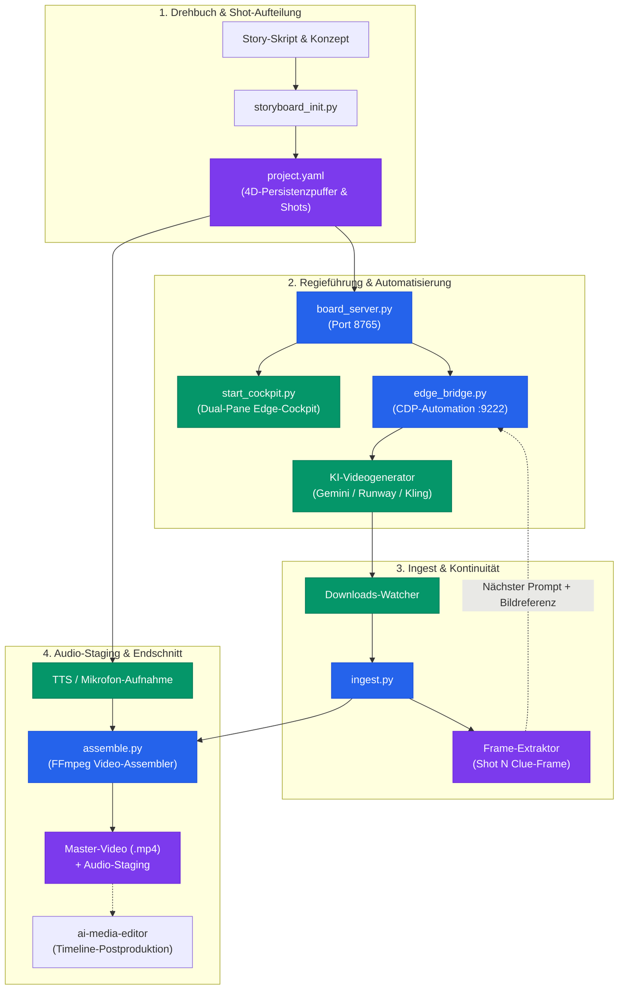
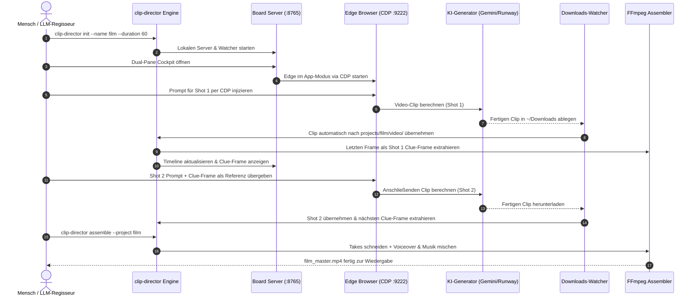

<p align="center">
  
</p>
<!-- alternate banner: assets/banner.svg (swap on occasion) -->

# clip-storyboard-director

<p align="center">
  <strong>Local-First KI-Regisseur & Szenen-Kontinuitäts-Orchestrator</strong><br>
  <em>Verbindet generative KI-Videomodelle, Browser-Automatisierung (CDP), 4D-Persistenzpuffer und Mehrspur-Audio-Mastering zu einer konsistenten filmischen Pipeline.</em>
</p>

<p align="center">
  <a href="README.md"><strong>English</strong></a> |
  <a href="README_de.md"><strong>Deutsch</strong></a>
</p>

<p align="center">
  <a href="https://github.com/ellmos-ai/clip-storyboard-director/actions/workflows/ci.yml"></a>
  <a href="#17-entwicklung-verifikation--qualitaets-gates"></a>
  <a href="https://img.shields.io/badge/python-3.10%20%7C%203.11%20%7C%203.12%20%7C%203.13-blue"></a>
  <a href="https://img.shields.io/badge/platform-Windows%20%7C%20Linux%20%7C%20macOS-lightgrey"></a>
  <a href="SECURITY.md"></a>
  <a href="THIRD_PARTY_LICENSES.md"></a>
  <a href="SECURITY.md"></a>
  <a href="THIRD_PARTY_LICENSES.md"></a>
  <a href="THIRD_PARTY_LICENSES.md"></a>
  <a href="NOTICE"></a>
  <a href="THIRD_PARTY_LICENSES.md"></a>
  <a href="MARKETING-LOG.txt"></a>
  <a href="https://github.com/astral-sh/ruff"></a>
  <a href="LICENSE"></a>
  <a href="https://github.com/ellmos-ai"></a>
  <a href="https://github.com/open-bricks"></a>
  <a href="https://github.com/ellmos-ai/clip-storyboard-director/releases"></a>
  <a href="llms.txt"></a>
  <a href="MARKETING-LOG.txt"></a>
</p>

---

### 🧭 Schnellnavigation

- [1. Executive Summary & Warum dieses Projekt existiert](#1-executive-summary--warum-dieses-projekt-existiert)
- [2. Systemarchitektur & Workflow](#2-systemarchitektur--workflow)
- [3. Das Regie- & Cutter-Duo](#3-das-regie---cutter-duo)
- [4. 4D-Persistenz & Bündige Kontinuität](#4-4d-persistenz--bündige-kontinuität)
- [5. Clue-Frame Kontinuitätskette](#5-clue-frame-kontinuitätskette)
- [6. Dual-Pane Regie-Cockpit](#6-dual-pane-regie-cockpit)
- [7. Mehrspur-Audio-Staging & Dynamisches Ducking](#7-mehrspur-audio-staging--dynamisches-ducking)
- [8. Governance- & Laufzeit-Invarianten](#8-governance---laufzeit-invarianten)
- [9. End-to-End Medien- & Produktions-Lebenszyklus](#9-end-to-end-medien---produktions-lebenszyklus)
- [10. Zielgruppen & Auffindbarkeit](#10-zielgruppen--auffindbarkeit)
- [11. Vergleichsmatrix gegenüber Alternativen](#11-vergleichsmatrix-vs-alternativen)
- [12. Drittanbieter-Lizenzen, Level 1 SBOM & RunAsInvoker](#12-drittanbieter-lizenzen-level-1-sbom--runasinvoker)
- [13. Geschwisterwerkzeuge & Partner-Matrix](#13-geschwisterwerkzeuge--partner-matrix)
- [14. Installation & CLI-Befehlsreferenz](#14-installation--cli-befehlsreferenz)
- [15. Referenzproduktion „Sternenseufzer“](#15-referenzproduktion-sternenseufzer)
- [16. Sicherheit & Datenschutz](#16-sicherheit--datenschutz)
- [17. Entwicklung, Verifikation & Qualitäts-Gates](#17-entwicklung-verifikation--qualitaets-gates)
- [18. Gesetzlicher Hinweis, Haftungsbeschränkung & Lizenz (§ 521 BGB)](#18-gesetzlicher-hinweis-haftungsbeschraenkung--lizenz--521-bgb)

---

<a id="1-executive-summary--why-this-exists"></a><a id="1-executive-summary--warum-dieses-projekt-existiert"></a><a id="why-this-exists"></a><a id="warum-dieses-projekt-existiert"></a>
## 1. Executive Summary & Warum dieses Projekt existiert

Einzelne KI-Videoclips über Modelle wie Veo, Kling, Sora oder Runway zu generieren, ist heute unkompliziert. Aus isolierten Kurzclips jedoch einen **zusammenhängenden narrativen Film** zu erstellen, scheitert in der Praxis an grundlegenden Hürden:

1. **Kontinuitäts-Drift**: Figuren verändern von Einstellung zu Einstellung Kleidung, Gesichtszüge oder Haarfarbe.
2. **Kontext-Amnesie**: Hintergrund-Schauplätze und Requisiten verformen sich oder verschwinden zwischen Schnitten.
3. **Manueller Download- & Upload-Frust**: Benutzer müssen Clips ständig händisch herunterladen, umbenennen, letzte Frames extrahieren und als Referenzbild wieder hochladen.
4. **Desynchronisierte Audio-Ebenen**: Synthetisierte Stimmen, Umweltgeräusche und Musik werden meist nachträglich ohne sauberes Timing oder Lautstärke-Ducking zusammengefügt.

`clip-storyboard-director` löst diese Herausforderungen durch eine automatisierte, lokale Regie-Pipeline. Das Werkzeug verwaltet einen **4D-Persistenzpuffer** über alle Szenen, extrahiert automatisch optische **Clue-Frames**, steuert Web-Generatoren über das **Chrome DevTools Protocol (CDP)**, überwacht Downloads und montiert mehrspurige Schnittfassungen – vollständig offline und ohne Telemetrie.

---

<a id="2-architecture--system-flow"></a><a id="2-systemarchitektur--workflow"></a><a id="architecture--system-flow"></a><a id="systemarchitektur--workflow"></a>
## 2. Systemarchitektur & Workflow



---

<a id="3-director--editor-duo"></a><a id="3-das-regie---cutter-duo"></a><a id="director--editor-duo"></a><a id="das-regie---cutter-duo"></a>
## 3. Das Regie- & Cutter-Duo

`clip-storyboard-director` ist gezielt als der **Regisseur** in einem spezialisierten Zwei-Agenten-Medienproduktionsmodell konzipiert:

| Rolle | Werkzeug | Fokus & Kernaufgaben |
| :--- | :--- | :--- |
| **Regisseur (Director)** | `clip-storyboard-director` | **Pre-Production & Generierung**: Drehbuchauflösung, Shot-Timing, Prompt-Formulierung, Pflege des 4D-Persistenzpuffers, Edge-CDP-Injektion, optische Clue-Frame-Verkettung, Download-Auto-Ingestion und Rohschnitt-Montage. |
| **Cutter (Editor)** | `ai-media-editor` | **Post-Production**: Nicht-lineare Schnittbearbeitung, Multi-Track-Schnitt, Color-Grading, sanfte Übergangskurven, dynamisches Audio-Ducking, subframe-genaue Schnitte und finale Ausspielung. |

> **Eigenständigkeits-Garantie**: `clip-storyboard-director` arbeitet zu 100 % autonom. Es setzt `ai-media-editor` nicht voraus, um vollständige Filme zu planen, zu generieren und zu montieren. Ist `ai-media-editor` vorhanden, gelingt die Übergabe reibungslos über standardisierte Projektordner oder Exportformate.

---

<a id="4-4d-persistence--bounded-continuity"></a><a id="4-4d-persistenz--buendige-kontinuitaet"></a><a id="4d-persistence--bounded-continuity"></a><a id="4d-persistenz--bündige-kontinuität"></a>
## 4. 4D-Persistenz & Bündige Kontinuität

Im Filmbereich umfasst Kontinuität drei Raumdimensionen plus die Zeitachse ($3D + T = 4D$). `clip-storyboard-director` sichert diese Parameter deklarativ über den `persistence_buffer` in `project.yaml`:

- **Figuren (Characters)**: Feste Identifikatoren, Kleidungsdetails, Statur, Haarfarbe und Gesichtsmerkmale.
- **Schauplätze (Locations)**: Raumaufbau, Architektur, Lichtverhältnisse und Kamerawinkel.
- **Requisiten (Props & Objects)**: Schlüsselobjekte, Materialeigenschaften, Gebrauchsspuren und physischer Zustand.
- **Atmosphäre (Palette)**: Farb-Grading-Stimmung, Wetterbedingungen, Tageszeiten und Raumakustik.

Jeder vom Regisseur erzeugte Prompt erbt automatisch diese Persistenzmerkmale, wodurch Stilbrüche und Modellhalluzinationen wirksam verhindert werden.

---

<a id="5-clue-frame-continuity-chain"></a><a id="5-clue-frame-kontinuitaetskette"></a><a id="clue-frame-continuity-chain"></a><a id="clue-frame-kontinuitätskette"></a>
## 5. Clue-Frame Kontinuitätskette

Die kritischste Bruchstelle bei sequentiellen KI-Videos ist der Schnittübergang. `clip-storyboard-director` etabliert die **Clue-Frame-Kontinuitätskette**:

1. **Deterministische Letzt-Frame-Extraktion**: Beim Ingest eines Takes $N$ nutzt `ingest.py` `ffprobe` und `ffmpeg`, um den exakt letzten sichtbaren Frame ($T_{\text{end}}$) verlustfrei zu sichern.
2. **Optische Referenz-Ablage**: Der Frame wird unter `projects/<name>/frames/shot<N>_lastframe.png` abgelegt.
3. **Automatische Prompt-Koppelung**: Vor der Erzeugung von Shot $N+1$ übergibt das System den Clue-Frame per CDP direkt an das Generator-Webinterface oder legt ihn arbeitsbereit auf dem Desktop ab.
4. **Nahtlose Bewegungskontinuität**: Das Videomodell startet exakt auf Basis des vorangegangenen Endbildes – ohne Bildspringen, mit konsistenter Kamerapositionierung und flüssiger Bewegung.

---

<a id="6-dual-pane-director-cockpit"></a><a id="6-dual-pane-regie-cockpit"></a><a id="dual-pane-director-cockpit"></a><a id="dual-pane-regie-cockpit"></a>
## 6. Dual-Pane Regie-Cockpit

Der Regisseur bietet ein webbasiertes Timeline-Cockpit, das über `start_cockpit.py` im Microsoft Edge App-Modus gestartet wird (`--app=http://localhost:8765/cockpit.html`):

- **Linkes Panel (Storyboard-Timeline)**: Szenenkarten mit Laufzeiten, aktiven Prompts, Clue-Frame-Vorschauen, Sprachwiedergabe und Take-Auswahl.
- **Rechtes Panel (Generierungs-Studio)**: Paralleles Browser-Fenster, das via CDP verbunden ist und Prompts per Klick direkt in Gemini, Kling oder Runway einfügt.
- **Echtzeit-Zustandssynchronisation**: Alle Änderungen im UI synchronisieren unmittelbar in die lokale `project.yaml` über REST-Endpunkte (`/api/projects/update_shot`).

---

<a id="7-multi-track-audio-staging--ducking"></a><a id="7-mehrspur-audio-staging--dynamisches-ducking"></a><a id="multi-track-audio-staging--ducking"></a><a id="mehrspur-audio-staging--dynamisches-ducking"></a>
## 7. Mehrspur-Audio-Staging & Dynamisches Ducking

Filmische Erzählungen leben vom mehrschichtigen Klang. `clip-storyboard-director` strukturiert das Audio in drei Ebenen:

1. **Dialog- & Sprachspur**: Lokale Sprachsynthese über `edge-tts` oder Live-Mikrofonaufnahmen direkt im Cockpit-Interface.
2. **Raumatmosphäre & Geräusche**: Szenenspezifische Umweltklänge (z. B. Sternwarten-Brummen, Windrauschen, Schritte).
3. **Filmmusik**: Musikalischer Soundtrack mit automatischer Lautstärkeabsenkung (Ducking) bei gesprochenen Dialogen via FFmpeg-Filter `sidechaincompress` und `amix`.

---

<a id="8-key-governance--runtime-invariants"></a><a id="8-governance---laufzeit-invarianten"></a><a id="key-governance--runtime-invariants"></a><a id="governance---laufzeit-invarianten"></a>
## 8. Governance- & Laufzeit-Invarianten

Die folgenden 10 Kern-Invarianten garantieren die Zuverlässigkeit und Sicherheit von `clip-storyboard-director`:

| Garantie | Invarianten-Code | Durchsetzungs-Mechanismus | Verifikations-Regel |
| :--- | :--- | :--- | :--- |
| **1. 100% Local-First Datenschutz** | `INV-LOCAL-01` | Null Telemetrie, keine externen Serverzugriffe. | Code-Audit belegt vollständige Offline-Fähigkeit. |
| **2. Unprivilegierte Ausführung** | `INV-UNPRIV-02` | Normaler Benutzermodus (`RunAsInvoker`). | `SECURITY.md` und Systemprüfung fordern keine Root-Rechte. |
| **3. Loopback-Port-Isolation** | `INV-LOOPBACK-03` | Server bindet strikt an `127.0.0.1:8765`. | Netzwerkprüfungen weisen `0.0.0.0` strikt ab. |
| **4. Subprozess-Sandboxing** | `INV-SANDBOX-04` | Parameter-Arrays für `ffmpeg` und `msedge`. | Kein `shell=True` in der gesamten Codebasis. |
| **5. 4D-Persistenz-Kontinuität** | `INV-CONTINUITY-05` | Puffer für Figuren/Orte in `project.yaml`. | Prompt-Kompilierung prüft Persistenz-Attribute. |
| **6. Clue-Frame-Verkettung** | `INV-CLUEFRAME-06` | Automatische Letzt-Frame-Extraktion je Take. | `ingest.py` garantiert Clue-Frame-Ablage. |
| **7. Autonome Entkopplung** | `INV-STANDALONE-07` | Lauffähig ohne `ai-media-editor`. | Test `test_standalone_without_media_editor` grün. |
| **8. Plattform-Parität** | `INV-MULTIOS-08` | `pathlib.Path` auf Windows, Linux und macOS. | CI-Matrix testet alle drei Betriebssysteme. |
| **9. Cloud-Sync-Resilienz** | `INV-SYNC-09` | Ausschlussmuster für Locks und Konfliktkopien. | `.gitignore` filtert Mutex- und Konfliktdateien. |
| **10. 48h Sicherheits-SLA** | `INV-SLA-10` | Bestätigung binnen 48h, Triage in 5 Tagen. | In `SECURITY.md` und Contract-Tests verankert. |

---

<a id="9-end-to-end-media-production-lifecycle"></a><a id="9-end-to-end-medien---produktions-lebenszyklus"></a><a id="end-to-end-media-production-lifecycle"></a><a id="end-to-end-medien---produktions-lebenszyklus"></a>
## 9. End-to-End Medien- & Produktions-Lebenszyklus



---

<a id="10-target-personas--discoverability"></a><a id="10-zielgruppen--auffindbarkeit"></a><a id="target-personas--discoverability"></a><a id="zielgruppen--auffindbarkeit"></a>
## 10. Zielgruppen & Auffindbarkeit

`clip-storyboard-director` wurde für vier zentrale Nutzergruppen im Ökosystem generativer Medien entwickelt:

| Zielgruppe | Herausforderungen & Frustrationen | Lösung & Nutzenversprechen | Typischer Workflow |
| :--- | :--- | :--- | :--- |
| **KI-Filmschaffende & Narrative Regisseure** | Figuren- und Kostüm-Drift zwischen Einstellungen, unzusammenhängende Schnitte, manuelles Prompt-Kopieren. | Deklarativer 4D-Persistenzpuffer (`project.yaml`) und automatische optische Clue-Frame-Verkettung zwischen Shot-Ende und Folgeeinstellung. | `clip-director init` -> 4D-Puffer definieren -> Clue-Frames prüfen -> Schnitt assemblieren. |
| **Generative Medien-Entwickler** | Webbasierte Videoportale bieten keine skriptfähige lokale Automation oder strukturierte Dateiübernahme. | Chrome DevTools Protocol (CDP) Bridge auf Port 9222 und Echtzeit-Download-Watcher mit automatischer Dateieinordnung. | Edge CDP Bridge starten -> Skriptbasierten Take-Loop ausführen -> Clips auto-ingesten. |
| **Content Creator & YouTuber** | Manuelle Stimmaufnahme, Timing und Abmischung mit Hintergrundmusik in komplexen Schnittprogrammen kostet Stunden. | Integrierte Sprachsynthese über `edge-tts` und automatisches Side-Chain-Audio-Ducking über vier dedizierte Tonspuren. | Szenendialoge schreiben -> `clip-director voice` -> `clip-director assemble`. |
| **Autonome Coding-Agenten** | Cloud-abhängige Tools erfordern Login-Tokens, Administrator-Rechte oder blockieren ohne Benutzeroberfläche. | 100% Local-First Zero-Egress Architektur (`INV-LOCAL-01`), unprivilegierte `RunAsInvoker`-CLI und maschinenlesbarer `llms.txt`-Kontext. | Headless-Ausführung per `clip-director auto` -> Systemprüfung per `clip-director doctor`. |

### Suchbegriffe mit hoher Absicht (High-Intent Keywords)

- **Deutsch**: `clip-storyboard-director lokale KI-Regie`, `KI Storyboard Regisseur Python`, `Szenen-Kontinuität generative Videomodelle`, `Clue-Frame optische Bildverkettung`, `Lokale Video-Orchestrierung ohne Cloud-Zwang`, `Edge CDP Browser-Automatisierung KI Video`, `4D-Persistenzpuffer Charakter-Kontinuität`, `Mehrspur-Audio-Staging und Ducking FFmpeg`.
- **Englisch**: `ai storyboard director`, `scene continuity python`, `clue-frame video generator`, `local-first ai video orchestrator`, `veo kling runway automation`, `edge cdp video workflow`, `4d persistence buffer`, `automated audio staging and ducking python`.

---

<a id="11-comparative-matrix-vs-alternatives"></a><a id="11-vergleichsmatrix-vs-alternativen"></a><a id="comparative-matrix-vs-alternatives"></a><a id="vergleichsmatrix-vs-alternativen"></a>
## 11. Vergleichsmatrix gegenüber Alternativen

Die nachfolgende Matrix vergleicht `clip-storyboard-director` über 10 Architektur- und Governance-Dimensionen mit vier gängigen Branchenalternativen:

| Dimension / Kriterium | `clip-storyboard-director` | Kommerzielle Video-SaaS (Runway / Pika / Kling) | Manueller Browser-Workflow | Schwergewichtige Desktop-NLEs (Premiere / DaVinci) | Ad-Hoc Python-Skripte & Shell-Glue |
| :--- | :--- | :--- | :--- | :--- | :--- |
| **1. Local-First & Zero-Egress** | **100% Local-First (`INV-LOCAL-01`)**; null Cloud-Telemetrie oder Medien-Leaks. | ❌ Zwingende Cloud-SaaS; Medien verbleiben auf Fremdservern. | ❌ Händische Web-Uploads; hohes Risiko von Datenabflüssen. | Lokale Desktop-App; kontinuierliche Hintergrund-Telemetrie. | Variiert; meist ungepinnte externe Cloud-APIs. |
| **2. Szenenkontinuität & 4D-Puffer** | **Integrierter 4D-Persistenzpuffer (`INV-CONTINUITY-05`)** für Figuren, Schauplätze, Objekte. | ⚠️ Ephemerer Prompt-Verlauf; häufiger Drift von Gesichtern & Kleidung. | ❌ Händisches Prompt-Kopieren; gravierender Kontextverlust. | ❌ Keine native generative Kontinuitäts-Engine. | ❌ Fragil; keine formalen 4D-Kontextmodelle implementiert. |
| **3. Optische Clue-Frame-Kopplung** | **Automatische Letzt-Frame-Extraktion (`INV-CLUEFRAME-06`)** zur Prompt-Vorbereitung. | ❌ Händisches Frame-Extrahieren und Re-Upload je Take. | ❌ Zeitintensiver Kreislauf aus Download, Frame-Schnitt und Upload. | ❌ Keine native Bildkopplung für KI-Generatoren vorhanden. | ⚠️ Ad-hoc FFmpeg-Skripte; keine automatische Seed-Prüfung. |
| **4. Browser-Generator-Steuerung** | **Direkte Chrome DevTools Protocol (CDP)** Kopplung auf Port `9222`. | ❌ Proprietäre geschlossene Web-UIs ohne API-Zugriff. | ❌ 100% manuelle Klicks, Drag-and-Drop und Parameter-Eingaben. | ❌ Keine direkte Browser-zu-Generator-Automationsbrücke. | ⚠️ Fragile Selenium- oder Playwright-Scraper. |
| **5. Audio-Staging & Mehrspur-Ducking** | **Integrierter 4-Spur-Mix + automatisches Sprach-Ducking** (`assemble.py`). | ❌ Minimaler oder einspuriger Ton; kein automatisches Ducking. | ❌ Kein Audio-Staging; erfordert separate Schnittwerkzeuge. | Manueller Mehrspur-Mix; hoher zeitlicher Bedienungsaufwand. | ❌ Komplexe Filtergraphen mit hohem Desynchronisationsrisiko. |
| **6. Dual-Pane Regie-Cockpit** | **Integriertes Split-Screen Dashboard** (Timeline & Generator-Bridge). | ❌ Einzeltab-Ansicht; unübersichtliche Vorschauen. | ❌ Unübersichtliches Desktop-Fenster- und Tab-Chaos. | Komplexe Bedienoberflächen mit hoher Einarbeitungszeit. | ❌ Reine Kommandozeile; keinerlei visuelle Timeline-Kontrollen. |
| **7. Ressourcen-Footprint & Level 1 SBOM** | **Schlanke Python-Stdlib + PyYAML / edge-tts**; auditierte Level 1 SBOM. | Hohe Systemlast durch permanente Web-Frontend-Bandbreite. | N/A (hohe manuelle Arbeitszeit und Browser-Speicherlast). | 5 GB+ proprietäre Installer mit starker GPU-Belastung. | Ungepinnte Virtualenvs; unvorhersehbare Abhängigkeiten. |
| **8. Agenten-Auffindbarkeit (LLM-Ready)** | **Standardisiertes `llms.txt` + `ellmos-module.v2.json`**; deterministisches CLI. | ❌ Anti-Bot Captchas und Login-Sperren. | ❌ Ungeeignet für autonome KI-Ausführung. | ❌ Proprietäre geschlossene Scripting-APIs (Lua/ExtendScript). | ⚠️ Ad-hoc CLI-Flags ohne strukturierte Metadaten. |
| **9. Berechtigungsmodell & Nutzersicherheit** | **Unprivilegiertes `RunAsInvoker` (`INV-UNPRIV-02`)**; Loopback-Bindung (`127.0.0.1`). | Cloud-Account mit Bezahlschranken und API-Schlüsseln. | Browser-Sitzung anfällig für Session-Hijacking. | Erfordert häufig administrative Elevation bei der Installation. | Variiert; gelegentlich versehentlich mit Root-Rechten ausgeführt. |
| **10. Sicherheits-SLA & Governance** | **Verbindliche 48h Antwort & 5 Tage Triage (`INV-SLA-10`)**; § 521 BGB Hinweis. | Allgemeine Standard-SaaS AGBs. | N/A; Eigenverantwortung des Endnutzers im Browser. | Träge unternehmensweite Patch-Zyklen des Herstellers. | ❌ Keinerlei Sicherheits-SLAs oder Triage-Garantien. |

---

<a id="12-third-party-licenses-level-1-sbom--runasinvoker"></a><a id="12-drittanbieter-lizenzen-level-1-sbom--runasinvoker"></a><a id="third-party-licenses--transparency"></a><a id="drittanbieter-lizenzen--transparenz"></a>
## 12. Drittanbieter-Lizenzen, Level 1 SBOM & RunAsInvoker

`clip-storyboard-director` folgt strengen Open-Source-Governance-Standards, permissiven Lizenzen und Zero-Egress-Laufzeitgarantien:

- **Hauptmodul**: Lizenziert unter der permissiven [MIT-Lizenz](LICENSE) mit Urheberrechtsnachweis in [NOTICE](NOTICE).
- **Laufzeit-Abhängigkeiten**:
  - `PyYAML` (MIT-Lizenz): Deklarative Projektkonfiguration und Persistenzpuffer-Parsing.
  - `edge-tts` (GNU GPL-3.0): Eigenständiger lokaler Sprachsynthese-Subprozess.
  - `websocket-client` (Apache-2.0): Lokale Chrome DevTools Protocol Socket-Kommunikation.
  - `requests` (Apache-2.0): Lokale HTTP-Zielerkennung auf `127.0.0.1:9222`.
- **System-Binärdateien**:
  - `FFmpeg / FFprobe` (LGPL-2.1+ / GPL-2.0+): Medieninspektion, Clue-Frame-Extraktion und Video-Assemblierung über System-`PATH`.
  - `Microsoft Edge`: Optionaler Host-Browser für Dual-Pane Cockpit und CDP-Automatisierung.
- **Compliance & Level 1 SBOM**:
  - `INV-LOCAL-01`: 100% offline, null Cloud-Tracking, null externe Telemetrie.
  - `INV-UNPRIV-02`: Ausführung streng im unprivilegierten Benutzermodus (`RunAsInvoker`).
  - Eine vollständige Level 1 SBOM und Invarianten-Kreuzreferenzmatrix sind in [THIRD_PARTY_LICENSES.md](THIRD_PARTY_LICENSES.md) dokumentiert.

---

<a id="13-sibling-tools--ecosystem-matrix"></a><a id="13-geschwisterwerkzeuge--partner-matrix"></a><a id="sibling-tools--ecosystem-matrix"></a><a id="geschwisterwerkzeuge--partner-matrix"></a>
## 13. Geschwisterwerkzeuge & Partner-Matrix

`clip-storyboard-director` ist Teil des **ellmos-ai**-Ökosystems und der Dachorganisation **open-bricks**:

| Repository | Domäne & Schwerpunkt | Beziehung zum Director |
| :--- | :--- | :--- |
| [ai-media-editor](https://github.com/ellmos-ai/ai-media-editor) | Postproduktion & Timeline-Editor | **Cutter-Partner**: Übernimmt assemblierte Schnitte zum Feinschliff. |
| [ellmos-voice-io](https://github.com/ellmos-ai/ellmos-voice-io) | Sprachsynthese & Audio-I/O | Liefert Stimmmodelle und Mehrfiguren-Audio-Staging. |
| [system-auditor](https://github.com/ellmos-ai/system-auditor) | Multi-Host Audit Engine | Überprüft Code-Hygiene, Lock-Governance und Metadaten-Parität. |
| [system-explorer](https://github.com/ellmos-ai/system-explorer) | Lokale System-Introspektion | Erkennt Hardware-Encoder (NVENC/VAAPI) und System-Codecs. |
| [ellmos-controlcenter-mcp](https://github.com/ellmos-ai/ellmos-controlcenter-mcp) | Governance & Capability Control | Steuert Agentenberechtigungen und Werkzeugfreigaben. |
| [ellmos-delegation-authority](https://github.com/ellmos-ai/ellmos-delegation-authority) | Autonome Aufgabendelegation | Koordiniert vollautonome Produktionsläufe. |
| [sqlite-transit-sync](https://github.com/ellmos-ai/sqlite-transit-sync) | Konfliktfreie Datenbank-Synchronisation | Gleicht Storyboard-Zustände zwischen Arbeitsstationen ab. |
| [memoryhooker-provenance](https://github.com/ellmos-ai/memoryhooker-provenance) | Kontext-Hooking & Gedächtnis | Hält Regie-Entscheidungen über lange Projekte konsistent. |
| [workflowhooker-provenance](https://github.com/ellmos-ai/workflowhooker-provenance) | Workflow-Tracking & Nachvollziehbarkeit | Dokumentiert Prompt-Historien, Take-Varianten und Modellversionen. |
| [automation-master](https://github.com/ellmos-ai/automation-master) | Enterprise Workflow-Automation | Steuert Hintergrund-Renderings und automatische Dateiübernahmen. |
| [automizer-for-claude-desktop](https://github.com/ellmos-ai/automizer-for-claude-desktop) | Claude Desktop Integration | Verbindet LLM-Assistenten direkt mit dem Timeline-Cockpit. |
| [WikiStub-Seed](https://github.com/ellmos-ai/WikiStub-Seed) | World-Building Wissensgraphen | Generiert detaillierte Hintergründe für den 4D-Persistenzpuffer. |
| [ProSync](https://github.com/file-bricks/prosync) | Resiliente Dateispiegelung | Spiegelt Videodaten zwischen Schnittplätzen. |
| [CleanMarkdown](https://github.com/doc-bricks/cleanmarkdown) | Dokumentations-Bereiniger | Formatiert Drehbücher, Skripte und Regieanweisungen. |
| [PrivacyMailDesk](https://github.com/dev-bricks/privacymaildesk) | Lokale E-Mail-Verarbeitung | Benachrichtigt Produzenten nach Renderschritten ohne Cloud-Tracking. |
| [prompt-archaeology-casestudy2](https://github.com/research-line/prompt-archaeology-casestudy2) | Prompt-Engineering-Forschung | Liefert praxiserprobte Prompts für Videomodelle. |
| [open-bricks](https://github.com/open-bricks/open-bricks) | Open-Source Dachorganisation | Definiert Governance-Standards, Sicherheits-SLAs und Release-Richtlinien. |

---

<a id="14-installation--cli-usage"></a><a id="14-installation--cli-befehlsreferenz"></a><a id="installation--cli-usage"></a><a id="installation--cli-befehlsreferenz"></a>
## 14. Installation & CLI-Befehlsreferenz

### Voraussetzungen

- **Python**: 3.10, 3.11, 3.12 oder 3.13
- **FFmpeg & FFprobe**: Im System-`PATH` erforderlich für Frame-Extraktion und Video-Schnitt
- **Microsoft Edge** (oder Chrome): Für optionale CDP-Browser-Automatisierung
- **Optionale Python-Pakete**: `edge-tts` (Sprachsynthese), `websocket-client` (CDP-Bridge)

### Installation

```bash
# Repository klonen
git clone https://github.com/ellmos-ai/clip-storyboard-director.git
cd clip-storyboard-director

# Paket im Entwicklungsmodus installieren
pip install -e ".[dev]"
```

### Systemprüfung (`doctor`)

Prüft alle Binärdateien, Python-Module und Browser-Verbindungen:

```bash
clip-director doctor
```

### Befehlsübersicht

```bash
# 1. Neues Storyboard-Projekt anlegen (60s Gesamtzeit, 10s je Einstellung)
clip-director init --name my_film --title "Mein Spielfilm" --duration 60 --step 10

# 2. Interaktives HTML-Timeline-Dashboard generieren
clip-director render --project projects/my_film

# 3. Lokalen Board-Server starten (Standard-Port 8765)
clip-director serve --project projects/my_film --port 8765

# 4. Dual-Pane Regie-Cockpit in Microsoft Edge öffnen
clip-director cockpit --project my_film

# 5. Verbindungsstatus zu Edge CDP prüfen
clip-director cdp-status --port 9222

# 6. Downloads-Ordner überwachen und neue Clips automatisch einbinden
clip-director ingest --project projects/my_film --watch

# 7. Dialogstimmen für eine bestimmte Szene synthetisieren
clip-director voice --project projects/my_film --step 1

# 8. Finales Master-Video inklusive Tonmischung ausspielen
clip-director assemble --project projects/my_film

# 9. Autonomen Produktionsdurchlauf starten
clip-director auto --project projects/my_film
```

---

<a id="15-reference-production-sternenseufzer"></a><a id="15-referenzproduktion-sternenseufzer"></a><a id="reference-production-sternenseufzer"></a><a id="referenzproduktion-sternenseufzer"></a>
## 15. Referenzproduktion „Sternenseufzer“

Das Repository enthält unter `projects/sternenseufzer/` eine vollständige Referenzproduktion:

- **Genre**: Sci-Fi-Drama / Kurzfilm
- **Handlung**: Ein Astronom in einer Gebirgssternwarte empfängt ein akustisches Resonanzsignal in Sternenlichtdaten.
- **Kontinuitäts-Matrix**: 4D-Persistenzpuffer für Dr. Alistair Vance, die Sternwartenkuppel und das Quanten-Spektrometer.
- **Sprachspuren**: Zweisprachige Direktiven (deutsche Quelle, englische Übersetzung) und Stummanweisungen.

Referenzprojekt direkt erkunden:
```bash
clip-director render --project projects/sternenseufzer
clip-director assemble --project projects/sternenseufzer
```

---

<a id="16-security-policy--privacy"></a><a id="16-sicherheit--datenschutz"></a><a id="security--privacy"></a><a id="sicherheit--datenschutz"></a>
## 16. Sicherheit & Datenschutz

- **Null-Telemetrie**: Keine Tracking-Pixel, keine Nutzungsstatistiken und keine externen Serveranfragen (`INV-LOCAL-01`).
- **Unprivilegierter Modus**: Läuft vollständig im Benutzermodus (`RunAsInvoker`, `INV-UNPRIV-02`).
- **Localhost-Bindung**: Web-Dienste lauschen strikt auf `127.0.0.1` (`INV-LOOPBACK-03`).
- **Sicherheits-SLA**: Bestätigung von Meldungen binnen 48 Stunden, qualifizierte Triage in 5 Werktagen (`INV-SLA-10`). Siehe [SECURITY.md](SECURITY.md).

---

<a id="17-development-verification--quality-gates"></a><a id="17-entwicklung-verifikation--qualitaets-gates"></a><a id="development--verification"></a><a id="entwicklung--verifikation"></a>
## 17. Entwicklung, Verifikation & Qualitäts-Gates

### Code-Prüfung & Bytecode-Kompilierung

```bash
ruff check src tests
python -m compileall -q src tests
```

### Testsuite ausführen

```bash
pytest -v
```

---

<a id="18-statutory-notice-liability-limitation--license--521-bgb"></a><a id="18-gesetzlicher-hinweis-haftungsbeschraenkung--lizenz--521-bgb"></a><a id="license--statutory-liability-limitation"></a><a id="lizenz--gesetzliche-haftungsbeschraenkung"></a><a id="license"></a>
## 18. Gesetzlicher Hinweis, Haftungsbeschränkung & Lizenz (§ 521 BGB)

### Gesetzlicher Hinweis & Haftungsbeschränkung (§ 521 BGB)
Die Bereitstellung dieser Software erfolgt unentgeltlich als Gefälligkeit (*unentgeltliche Schenkung* gemäß **§ 521 BGB**). Die Haftung des Autors sowie der Mitwirkenden ist gemäß deutschem Gesetzesrecht auf Vorsatz und grobe Fahrlässigkeit beschränkt.

### Lizenz
Dieses Projekt ist unter den Bedingungen der **MIT-Lizenz** lizenziert. Siehe [LICENSE](LICENSE) und [NOTICE](NOTICE) für vollständige Urheberrechts- und Attributierungsangaben.

---

<p align="center">
  Teil der <strong><a href="https://github.com/ellmos-ai">ellmos-ai</a></strong> Werkzeugfamilie unter dem Dach von <strong><a href="https://github.com/open-bricks">open-bricks</a></strong>.
</p>
